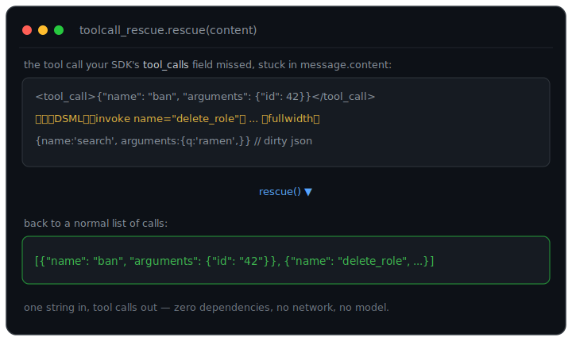

# toolcall-rescue

**Your local model called a tool. The SDK's `tool_calls` field came back empty — the call is sitting in `message.content` as XML, single-quoted JSON, a Hermes tag, or fullwidth-unicode gibberish. Your tool never fires.**
`toolcall-rescue` pulls it back out into a normal `[{"name", "arguments"}]` list. One string in, tool calls out — zero dependencies, no network, no model.

[](#tests)
[](LICENSE)
[](pyproject.toml)
[](pyproject.toml)

<p align="center">
  
</p>

```python
from toolcall_rescue import rescue

rescue('<tool_call>{"name": "get_weather", "arguments": {"city": "NYC"}}</tool_call>')
# [{'name': 'get_weather', 'arguments': {'city': 'NYC'}}]
```

---

## Why this exists

The OpenAI chat API returns tool calls in a structured `tool_calls` field, and
most SDKs read only that field. But plenty of models — local models behind
llama.cpp, quantized fine-tunes, and some hosted models like DeepSeek — don't
reliably fill it in. Instead the call shows up as text inside `message.content`:

- a Hermes/NousResearch `<tool_call>{...}</tool_call>` block,
- a Markdown ```` ```json ```` fence,
- "dirty" JSON with single quotes / trailing commas / comments,
- Anthropic-style `<invoke><parameter>` XML,
- or — memorably — DeepSeek emitting that XML with **fullwidth** delimiters
  (`｜` `＜` `＞`, U+FF5C / U+FF1C / U+FF1E) instead of ASCII.

Your SDK sees a plain string and your tool never fires. This library is the
small, boring, well-tested salvage layer that turns that string back into a
tool call — with **zero third-party dependencies** and no network calls. It is
deliberately a fallback, not a framework: check your `tool_calls` field first,
reach for `rescue` when it's empty.

## Install

```bash
git clone https://github.com/insomniac-asif/toolcall-rescue
cd toolcall-rescue
pip install .            # or: pip install -e ".[dev]" to run the tests
```

Python 3.8+. No third-party dependencies.

## Quickstart

```python
from toolcall_rescue import rescue, strip

content = "let me check that\n" \
          '<tool_call>{"name": "web_search", "arguments": {"query": "python"}}</tool_call>'

rescue(content)   # -> [{'name': 'web_search', 'arguments': {'query': 'python'}}]
strip(content)    # -> 'let me check that'
```

`rescue(content)` returns `[]` cleanly when there is no call, so it drops in as a
fallback after the normal `message.tool_calls` path:

```python
calls = message.tool_calls or rescue(message.content or "")
```

The public surface is four functions:

- `rescue(content)` → list of `{name, arguments}` calls (possibly empty).
- `rescue_first(content)` → the first call, or `None`.
- `strip(content)` → the same text with the recovered tool-call markup removed.
- `normalize_fullwidth(text)` → the fullwidth→ASCII pass, exposed for reuse.

## Dialects handled

Parsers are tried in ranked order; the first that matches wins. Delimiter-scoped
dialects (fenced / XML / Hermes) are tried before the bare-JSON scan so that
`strip` removes the whole wrapper, not just the JSON inside it.

| # | Dialect | Example (abridged) |
|---|---------|--------------------|
| 1 | Fenced code block | ```` ```json\n{"name":"f","arguments":{...}}\n``` ```` |
| 2 | XML / DSML `invoke`, incl. fullwidth delimiters | `<invoke name="f"><parameter name="p">v</parameter></invoke>` |
| 3 | Hermes-style tag | `<tool_call>{"name":"f","arguments":{...}}</tool_call>` |
| 4 | Bare JSON scan — OpenAI `tool_calls` / `function` wrappers or plain `{name, arguments}`, including dirty JSON (single quotes, trailing commas, `//` comments, unquoted keys) | `{name:'f', arguments:{a:1,}}` |
| — | Multiple calls in one message | any of the above, repeated |

OpenAI's double-encoded `arguments` string (a JSON string *inside* the JSON) is
parsed back into a dict on the way out.

## Example output

Real output from [`examples/demo.py`](examples/demo.py):

```text
=== openai json (embedded) ===
  rescue: [{'name': 'get_weather', 'arguments': {'city': 'Tokyo'}}]
  strip : 'sure!'

=== fenced json ===
  rescue: [{'name': 'search', 'arguments': {'q': 'best ramen'}}]
  strip : 'on it:'

=== dirty json ===
  rescue: [{'name': 'roll', 'arguments': {'sides': 20}}]
  strip : '// go'

=== hermes tag ===
  rescue: [{'name': 'ping', 'arguments': {}}]
  strip : ''

=== xml invoke ===
  rescue: [{'name': 'book', 'arguments': {'city': 'Paris', 'nights': '3'}}]
  strip : ''

=== dsml fullwidth ===
  rescue: [{'name': 'delete_role', 'arguments': {'role_id': '151084'}}]
  strip : ''

=== no call ===
  rescue: []
  strip : 'nothing to call here, just chatting'
```

### CLI

A small CLI reads from a file or stdin:

```bash
echo '<tool_call>{"name":"ping","arguments":{}}</tool_call>' | toolcall-rescue
# [
#   {
#     "name": "ping",
#     "arguments": {}
#   }
# ]

toolcall-rescue --strip message.txt   # print content with the markup removed
```

## How it works

1. **Normalize** fullwidth `｜＜＞` to ASCII `|<>`. This is a 1:1 character
   mapping, so string indices are preserved — which is what lets `strip` later
   remove exact spans.
2. **Try each dialect parser in order** and return the first non-empty result:
   fenced block → XML/DSML `invoke` → Hermes `<tool_call>` → bare JSON scan.
   The JSON scan walks the text finding balanced `{...}` / `[...]` regions
   (string- and comment-aware) and parses each with a tiny built-in tolerant
   JSON reader (`_json5.py`) that accepts single quotes, trailing commas,
   comments, and unquoted keys.
3. **Canonicalize** every recognized shape — OpenAI `tool_calls`, a bare
   `function` object, or a plain `{name, arguments}` — into
   `{"name": str, "arguments": dict}`.
4. **Guard against false positives:** the bare-JSON scan requires a call-ish
   shape (a `name` plus an arguments key, or a `function` / `tool_calls`
   wrapper), so ordinary data like `{"name": "Bob", "age": 3}` is **not**
   treated as a call.

## Limitations

Honest boundaries, not fine print:

- **Inference servers increasingly parse these upstream.** vLLM, llama.cpp,
  Ollama, and others ship tool-call parsers (Hermes, Mistral, etc.) that will
  often populate `tool_calls` for you. This library is for the cases they
  *miss* — older/edge builds, unusual fine-tunes, or providers that leak markup
  into `content`. Check your `tool_calls` field first; reach for `rescue` as a
  fallback.
- **XML/DSML parameter values are untyped and returned as strings**, except a
  value that is itself a JSON object/array (which is parsed). `<parameter
  name="n">3</parameter>` yields the string `"3"`, not `3` — the markup carries
  no type information, so coercing would be guessing.
- **Heuristic, not a grammar.** It targets the common real-world shapes above.
  Deeply nested or exotic markup, or a call split across non-adjacent fragments,
  may not be recovered.
- **First dialect wins.** If a single message genuinely mixes dialects, only the
  highest-ranked matching dialect's calls are returned.
- **No streaming.** `rescue` operates on a complete string, not partial chunks.
- **No JSON-repair magic beyond the documented leniencies.** Truncated or
  structurally broken JSON that a human couldn't unambiguously read is not
  reconstructed.

## Tests

```bash
pip install -e ".[dev]"
python -m pytest -q      # 32 tests, fully offline — no network, no model, no GPU
```

Runs in ~0.03s and covers every dialect plus multi-call, no-call, and
malformed-but-recoverable cases. See [`CONTRIBUTING.md`](CONTRIBUTING.md) for how
to add a new dialect (the main extension point).

## License

MIT © 2026 insomniac-asif
